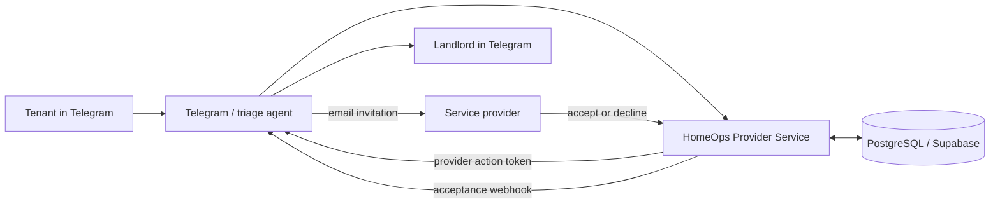

```

# AI Rental Maintenance Agent

AI Rental Maintenance Agent turns a tenant's maintenance report into a tracked provider request. A tenant reports an issue in Telegram with text, a photo, or a voice note; the wider agent workflow triages it, keeps the landlord informed, and sends an appropriate provider a request by email. The provider can accept or decline from a signed link. When a provider accepts, the tenant and landlord can be notified in Telegram.

The repair visit itself is outside this project's scope. Telegram is the demo channel; the triage, matching, and dispatch flow can be used with another messaging channel.

## Components

| Component | Purpose | Stack |
| --- | --- | --- |
| [`exa-specialists-finder`](./exa-specialists-finder) | Finds plumbers, electricians, and locksmiths by Spanish city, enriches/ranks results, and persists provider data. | TypeScript, Express, Exa, PostgreSQL |
| [`homeops-provider-service`](./homeops-provider-service) | Resolves the tenant, property, and landlord; selects an eligible provider; records request state; and handles signed provider responses. | Python, FastAPI, PostgreSQL/Supabase |


The HomeOps provider service is the dispatch boundary for a Telegram-facing agent: the agent delivers its one-time provider action link by email, while HomeOps owns matching and request state. On acceptance, HomeOps can send a signed webhook to the Telegram agent.



## Run HomeOps locally

HomeOps has the complete API reference, database schema, and diagrams in its [service README](./homeops-provider-service/README.md). For a local start:

```bash
cd homeops-provider-service
cp .env.example .env
# Set DATABASE_URL and APPLICATION_ACTION_SECRET in .env

python -m venv .venv
source .venv/bin/activate
pip install -r requirements.txt

python scripts/run_migrations.py
python scripts/seed_demo.py  # optional demo tenant, property, and providers
uvicorn src.api:app --reload
```

The API listens on `http://127.0.0.1:8000`; use `/docs` for its interactive OpenAPI documentation and `/health` for a health check. `POST /match` previews an eligible provider match without saving it, while `POST /applications` creates a request and returns the action token for the provider email.

For acceptance notifications, set `TELEGRAM_AGENT_WEBHOOK_URL`; optionally set `TELEGRAM_AGENT_WEBHOOK_SECRET` to sign outgoing webhook requests.

## Provider discovery service

The Exa service exposes `POST /specialists` and expects a `city` body field. It needs an `.env` containing its Exa credentials and `POSTGRESS` PostgreSQL connection string:

```bash
cd exa-specialists-finder
npm install
npm run dev
```

```bash
curl -X POST http://127.0.0.1:3000/specialists \
  -H 'Content-Type: application/json' \
  -d '{"city":"Valencia"}'
```

## Data and security

PostgreSQL/Supabase stores tenants, landlords, properties, providers, service requests, and each provider-invitation attempt. HomeOps action tokens are signed, expire after 48 hours, and are single use. Keep `.env` files and database credentials out of version control.

## Roadmap

Landlord-side smart-home sensors could eventually detect maintenance issues proactively, before a tenant reports them.

