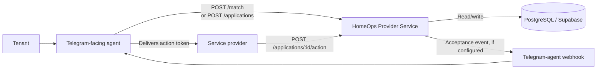
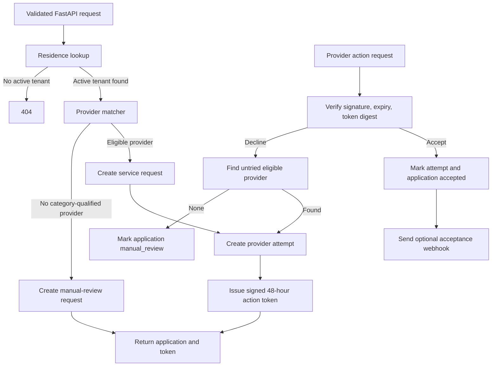
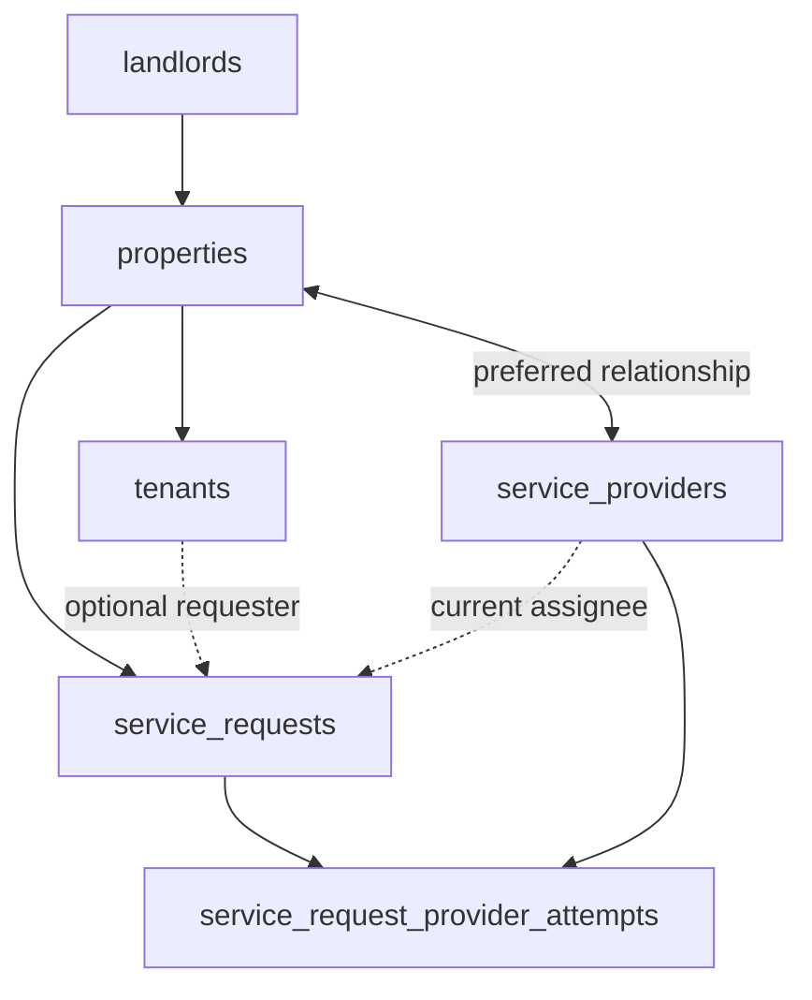

# System diagrams

These diagrams describe the current dispatch-only service. Provider discovery
is intentionally outside this application.

## System context

The agent handles conversation and delivery of the provider invitation. The
service handles matching, persistent application state, and secure provider
responses.

## Internal request path

## Application state transitions

```mermaid
stateDiagram-v2
    [*] --> pending_provider: eligible provider selected
    [*] --> manual_review: no eligible provider

    pending_provider --> accepted: provider accepts
    pending_provider --> pending_provider: provider declines; next provider selected
    pending_provider --> manual_review: provider declines; no alternatives

    accepted --> [*]
    manual_review --> [*]
```

Each pending provider invitation has a matching
`service_request_provider_attempts` record. A provider can answer only its own
pending attempt, and one provider cannot be invited twice for the same
application.

## Data ownership

