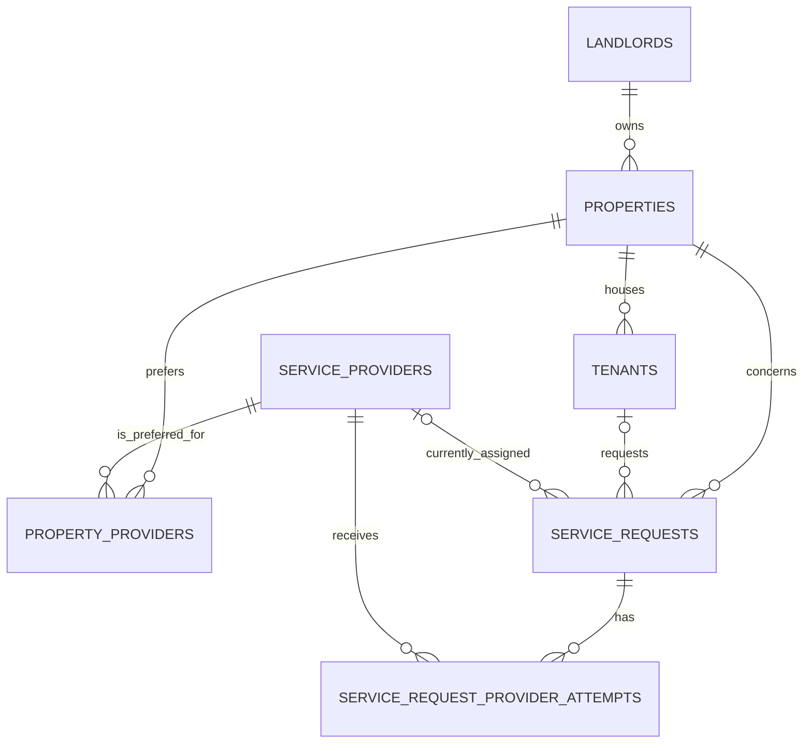

# Database and API schemas

All primary keys are UUIDs. Timestamps are `TIMESTAMPTZ`. The SQL migrations in `migrations/` are the source of truth; this page is the operational map of the current schema.

## Data model



| Table | Purpose | Key fields |
| --- | --- | --- |
| `landlords` | Property owner/contact directory. | `name`, contact details, `telegram_id` |
| `properties` | Managed locations. | `landlord_id`, address, city/country, coordinates |
| `tenants` | Occupancy and tenant contact identity. | `property_id`, `telegram_id`, `is_active`, move dates |
| `service_providers` | Provider directory and matching attributes. | contacts, location, `categories text[]`, `brands text[]` |
| `property_providers` | Optional property-specific provider relationship. | composite key: `property_id`, `provider_id` |
| `service_requests` | Current repair-application record. | `status`, issue tags, location snapshot, tenant/provider FKs, score/reasons |
| `service_request_provider_attempts` | Invitation history for a request. | request/provider FKs, `status`, token digest, expiry, response details |

`tenants` has a partial unique index: only one active tenant may have a given `telegram_id`. `service_request_provider_attempts` has a unique `(service_request_id, provider_id)` pair, preventing a declined provider from being invited again for the same application.

### Application statuses

| Status | Meaning |
| --- | --- |
| `pending_provider` | A selected provider has a pending invitation. |
| `accepted` | A provider accepted the invitation. |
| `manual_review` | No eligible provider exists, or all eligible providers declined. |

Provider-attempt statuses are `pending`, `accepted`, and `declined`.

## HTTP API

FastAPI validates these payloads and exposes the live OpenAPI schema at `/openapi.json` (and Swagger UI at `/docs`).

### `GET /health`

Returns `{"status":"ok"}`. It checks process liveness only; it does not open a database connection.

### `POST /match`

Non-persistent preview of residence resolution and matching.

```json
{
  "telegram_id": "10001",
  "categories": ["appliance_repair"],
  "brands": ["Bosch"],
  "urgency": "normal",
  "summary": "Washer will not start",
  "findings": {"appliance": "washing_machine"}
}
```

Required: `telegram_id`, non-empty `categories`. `brands`, `findings`, `summary`, and `urgency` are optional. The result includes `tenant`, `property`, `landlord`, selected `engineer`, `alternatives`, normalized `signals`, `contacts`, and `manual_review_required`.

### `POST /applications`

Uses the same shape as `/match`, but `summary` is required and at least three characters. It writes a `service_requests` row. If a provider is selected, it also writes a pending `service_request_provider_attempts` row and returns:

```json
{
  "ok": true,
  "application": {"application_id": "UUID", "status": "pending_provider"},
  "provider_action": {"attempt_id": "UUID", "token": "signed-token", "expires_in_hours": "48"},
  "manual_review_required": false,
  "webhook": {"delivered": false, "reason": "event_not_supported_by_telegram_webhook"}
}
```

For manual review, `provider_action` is `null` and the application status is `manual_review`.

### `POST /applications/{application_id}/action`

```json
{"token": "signed-token", "decision": "accept", "decline_reason": null}
```

An email acceptance button uses `GET /applications/{application_id}/action?token=signed-token`, which accepts the invitation directly. `POST /applications/{application_id}/action` supports `accept` or `decline`; `decline_reason` is optional and limited to 500 characters. The token must belong to the path application and the pending invitation. A decline returns either a fresh `provider_action` for the next eligible provider or `null` when the application enters manual review.

## Errors and integrations

Invalid request data is `422`; an unknown tenant or application is `404`; an invalid, expired, cross-application, or already-consumed provider token is `403` or `422`; unavailable dependencies such as the database become `503`.

If `TELEGRAM_AGENT_WEBHOOK_URL` is configured, an accepted request makes a JSON webhook call with event `technician_task_accepted`, the application UUID as `incident_id`, tenant/landlord Telegram IDs, and a `technician` object (`id`, `name`, `telegram_id`, `phone`, and `email`) for the provider who accepted. With `TELEGRAM_AGENT_WEBHOOK_SECRET`, headers are HMAC-SHA256 signed over `timestamp + "." + raw body`.
